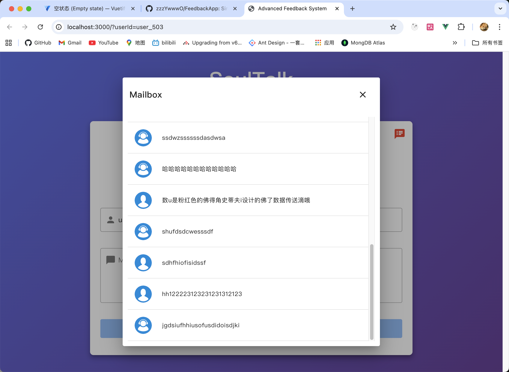
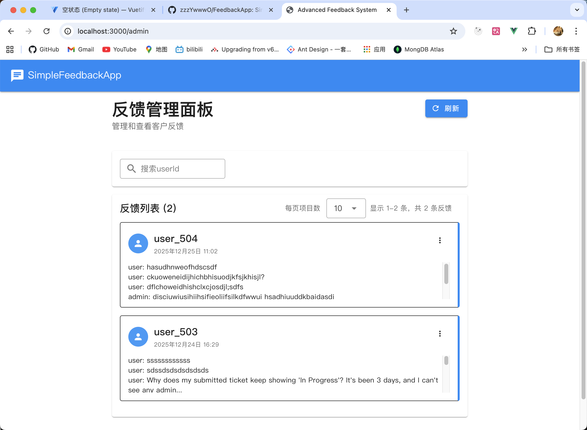
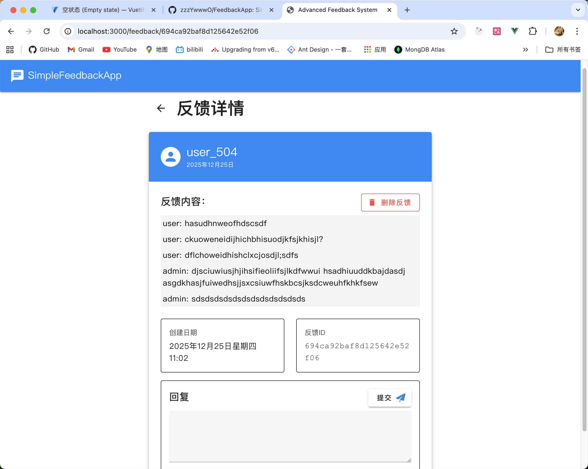

# FeedbackApp

A simple and lightweight feedback management system built with:

- 🖥️ **Frontend**: Vue 3 + Vuetify 3 + Vite  
- 🌐 **Backend**: Node.js + Express  
- 🗄️ **Database**: MongoDB (Mongoose)

Users can submit feedback with a rating and message.  
Admins can login, view, filter, and manage feedback via a clean and responsive dashboard.

---
## 运行与env
- 前端打包前配置一下服务器的端口等
  ```bash
  # /client/.env
  # 不能是本地的，笔记
  VITE_BASE_URL=http://localhost:3000
  ```
- 在/server下新建.env 
  ```bash
    PORT=3000
    MONGODB_URI=mongodb://localhost:27017/simplefeedback # 数据库地址(本地测试示例)
    NODE_ENV=production
  ```
- ==注意：数据库连接需要新建一个数据库，命名为simplefeedback，用于专门存放反馈和回复的信息==
- 项目已经打包dist，直接在后端`/server`运行`node app.js`, 即可在本地运行
- 前端和后端本地地址
  ```
    🚀 Production mode: Serving static files from dist/
    user: http://localhost:3000/?userId=user_503  # 测试用户id，可以自定义 
    admin: http://localhost:3000/admin
  ```
---

## 🚀 Getting Started(development)

### 1. Clone the repository

```bash
git clone https://github.com/yberman8/FeedbackApp.git
```

---

### 2. Frontend Setup (`client`)

```bash
cd client
npm install
```

Create a `.env` file in `client/`:

```env
VITE_BASE_URL=http://localhost:3000
```

Run the frontend:

```bash
npm run dev
```

---

### 3. Backend Setup (`server`)

```bash
cd server
npm install
```

Create a `.env` file in `server/`:

```env
VITE_BASE_URL=http://localhost:3000
SECRET_WORD=feedbackProjectDemo
PORT=3000
PORT_FRONTEND=5173
MONGODB_URI=mongodb://127.0.0.1:27017/simplefeedback
```

Run the backend:

```bash
node app.js
```

---

## ✅ Features

- Submit feedback with name, rating (1–5), and message
- Admin dashboard with search, filters, and statistics
- Responsive design (Vuetify)
- Demo admin user and 12 sample feedback auto-created on first run

---

## 🧱 Tech Stack

- Vue 3
- Vuetify 3
- Vite
- Node.js
- Express.js
- MongoDB (Mongoose)

---

## 🖼️ Screenshots





## 📄 License

This project is open for demonstration and educational use.  
You may reuse and modify it with credit to the author.

---

## 🙋‍♂️ Author

Developed by [Yossi Berman](https://github.com/yberman8)